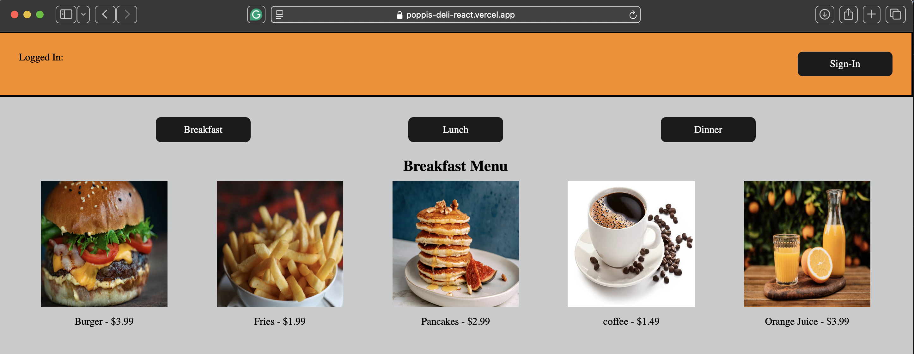
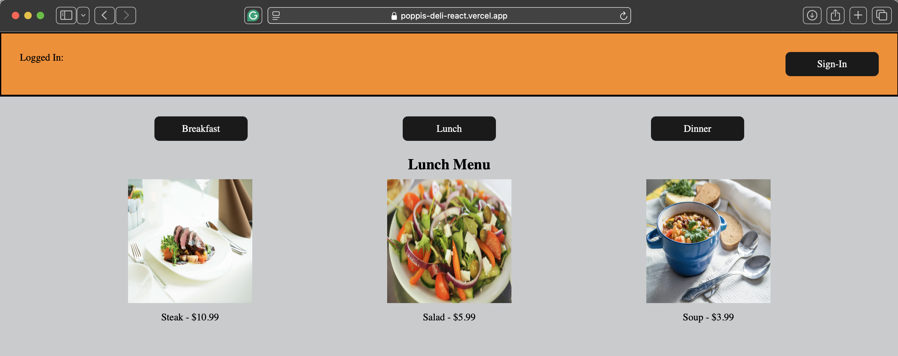
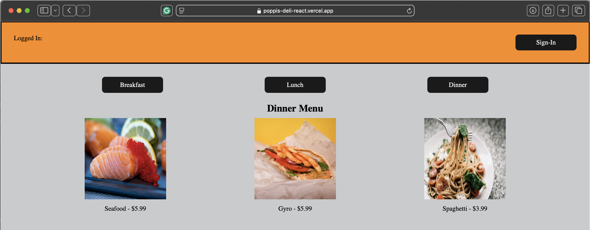
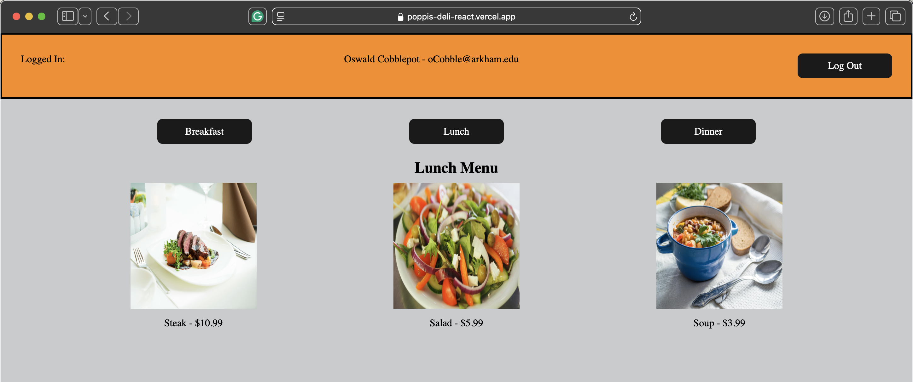

# React + Vite

# Project name: PoppisDeli
# Author: Michael Marquez
# Sep 23, 2024 - PerScholas RTT-31

Project description: Usage of React + vite, components.
    This project controls the State variable causing the webpage to instantly refresh its contents.

    Assets: 
    ===============
       o Buttons for sign-in, logout, breakfast, lunch, and dinner. 

 ### deployment: https://poppis-deli-react.vercel.app
 
 
 
 
